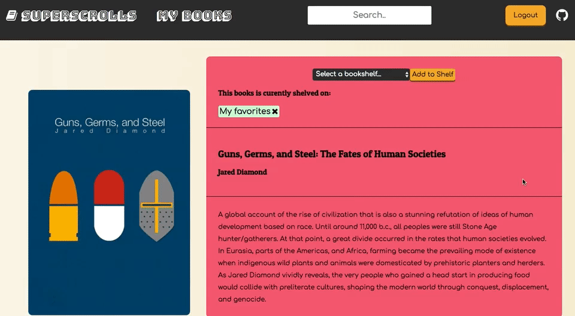

# [**Super Scrolls**](http://superscrolls.herokuapp.com)

SuperScrolls is a single page web application inspired by [Goodreads][goodreads]. SuperScrolls allows users to browse, search, edit, review and create books, as well as manage bookshelves.

[goodreads]: https://www.goodreads.com/

The stack for SuperScrolls includes:

* PostgreSQL Database
* Ruby on Rails
* React / Redux

# **Features and Implementation**

### **User Registration**

Users can sign up for SuperScrolls, which implements a hand-rolled authentication relying on a hashed/salted password. Users can also use a demo account to view certain features which have been restricted to registered guests. User settings are saved via cookies and are kept logged in between sessions.


### **Books**

The front page of the app is the Books index, or the library. Users can scroll through the list of books to browse the selection. This page utilizes an infinite scrolling feature, which checks if the user is near the bottom of the page, and fetches more books to display.


### **Reviews**

Users can read reviews of books and write one of their own. Users can also delete and edit their own review. Users can only write one review per book. To edit a review a user can simply click their review and a form will appear in place of the review body.



### **Bookshelves**

Users can organize books in bookshelves. To view one's bookshelves a user can simply click on the "My Books" link in the navbar. Here a user can view, create, and delete their bookshelves. By default a user starts with 3 bookshelves which cannot be deleted. These are the "Have Read", "Currently Reading", and "Want to Read" shelves. These shelves are also mutually exclusive in that a book cannot be on more than one at the same time. If a user adds a book to one of these three shelves, it will automatically be removed from either of the other two.


```javascript
if @shelving.bookshelf.default_shelf
  all_shelvings = Shelving.includes(:bookshelf).where(book_id: @shelving.book_id)
  all_shelvings.each do |shelving|
    next if shelving.id == @shelving.id
    if shelving.bookshelf.default_shelf && current_user.id == shelving.bookshelf.user_id
      shelving.destroy
    end
  end
end
```


### **Search**

Users can search for books by title anywhere in SuperScrolls via the Navbar. The search bar will list a dropdown of the first 5 books that meet the criteria. Users can click on any of the search results to be routed to that book's page.


### **Book Recommendations***

Displayed on a book's page are a list of book endorsements based on likes of other users. This is implemented live and will dynamically update. These books are found on the model level and passed down from the backend.

```ruby
def common_likes
  total_likes = []

  self.likes.each do |like|
    other_likes = like.user.likes.reject{ |like| like.book.id == self.id }
    other_likes.each do |like|
      total_likes.push(like)
    end
  end

  books_by_frequency = {}

  total_likes.each do |like|
    if books_by_frequency[like.book]
      books_by_frequency[like.book] += 1
    else
      books_by_frequency[like.book] = 1
    end
  end

  common_books = books_by_frequency.sort_by{ |k, v| v }
  common_books[0..2]
end
```

## **Future Plans for SuperScrolls**

#### Author Pages

Users would be able to click on the author name anywhere it is listed to be directed to that author's individual page. Here would be information about the author as well as their bibliography.

#### Comments and Likes

I would like to add features to like both books and reviews as well as add chainable comments to reviews.

#### Improvement to the Search function

I would like to be able to improve the search feature to implement search by author. Additionally I would like to display a link to view all results, instead of just the first five.

#### Book Recommendations

On book's page would be a list of books most liked by users who also enjoy said book.

#### Mobile Friendly

Implement proper CSS media queries to make SuperScrolls more accessible to mobile devices.
